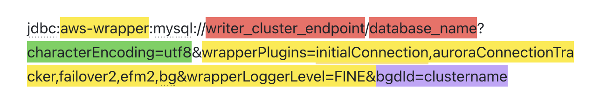

# Aurora MySQL Configuration Guide

## Overview

This guide explains how to configure a Spring Boot application to connect to AWS Aurora MySQL cluster with Blue/Green Deployment Plugin enabled.

## JDBC URL Details

### Complete Format



**Example:**
```
jdbc:aws-wrapper:mysql://my-cluster.cluster-xxx.us-east-1.rds.amazonaws.com/testdb?characterEncoding=utf8&wrapperPlugins=initialConnection,auroraConnectionTracker,failover2,efm2,bg&wrapperLoggerLevel=FINE&bgdId=my-cluster
```

### Parameter Description

| Color | Parameter | Description |
|-------|-----------|-------------|
| Red | `writer_cluster_endpoint`, `database_name` | Business-specific connection parameters |
| Green | `characterEncoding=utf8` | Native MySQL connection parameters |
| Yellow | `wrapperPlugins=...`, `wrapperLoggerLevel=...` | **Required Wrapper parameters (Important)** |
| Purple | `bgdId=clustername` | Required for multi-cluster scenarios (see below) |

### Important Notes

1. **Do NOT use** `autoreconnect=true` - It interferes with Wrapper's failover mechanism
2. **Must use Cluster Endpoint**, not instance endpoint

### bgdId Parameter

**Single Cluster**: If your application connects to only one Aurora MySQL cluster, `bgdId` is optional

**Multi-Cluster**: If your application connects to multiple Aurora MySQL clusters simultaneously, you need to add a unique `bgdId` value (recommended: cluster name). Connections to the same cluster should use the same `bgdId`

#### Multi-Cluster Example

If an application connects to both cluster-a and cluster-b:

**URL for cluster-a:**
```
jdbc:aws-wrapper:mysql://cluster-a.cluster-xxx.rds.amazonaws.com/database?characterEncoding=utf8&wrapperPlugins=initialConnection,auroraConnectionTracker,failover2,efm2,bg&wrapperLoggerLevel=FINE&bgdId=cluster-a
```

**URL for cluster-b:**
```
jdbc:aws-wrapper:mysql://cluster-b.cluster-xxx.rds.amazonaws.com/database?characterEncoding=utf8&wrapperPlugins=initialConnection,auroraConnectionTracker,failover2,efm2,bg&wrapperLoggerLevel=FINE&bgdId=cluster-b
```

## Prerequisites

### 1. Aurora Cluster Information

- **Cluster Endpoint**: `database-1.cluster-xxxxx.us-east-1.rds.amazonaws.com`
- **Database Name**: `testdb`
- **Username**: `admin`
- **Password**: `your-password`

### 2. Network Access

- Aurora security group allows inbound traffic on port 3306
- Application deployed in same VPC or connected via VPC Peering

## Quick Configuration

### Using Environment Variables

```bash
AURORA_CLUSTER_ENDPOINT="database-1.cluster-xxxxx.us-east-1.rds.amazonaws.com" \
AURORA_DATABASE="testdb" \
AURORA_USERNAME="admin" \
AURORA_PASSWORD="your-password" \
WRAPPER_LOG_LEVEL="FINE" \
./run-aurora.sh prod
```

## Profiles

| Profile | Log Level | Pool Size | Use Case |
|---------|-----------|-----------|----------|
| `aurora-prod` | FINE | max: 50 | Production |
| `aurora-dev` | FINEST | max: 20 | Development/Debug |

## Tech Stack

### Connection Pool: HikariCP

Spring Boot uses HikariCP by default, configured in `application.yml`:

```yaml
spring:
  datasource:
    hikari:
      pool-name: AuroraHikariPool
      minimum-idle: 10
      maximum-pool-size: 50
      idle-timeout: 300000
      max-lifetime: 600000
      connection-timeout: 30000
```

### Wrapper Plugins

| Plugin | Function |
|--------|----------|
| `initialConnection` | Initial connection handling |
| `auroraConnectionTracker` | Aurora connection tracking |
| `failover2` | Automatic failover |
| `efm2` | Enhanced failure monitoring |
| `bg` | Blue/Green deployment support |

### Log Levels

| JUL Level | Log4j2 Level | Description |
|-----------|--------------|-------------|
| INFO | INFO | Basic information |
| FINE | DEBUG | Production recommended, shows BG plugin status |
| FINER | DEBUG | Detailed plugin execution flow |
| FINEST | TRACE | Testing recommended, full debug information |

## Verification

### 1. Test Connection

```bash
curl http://localhost:8080/api/test
```

### 2. View Logs

```bash
# Wrapper logs
tail -f logs/wrapper.log

# BG Plugin related
grep -i "blue.*green\|BlueGreen" logs/wrapper.log
```

## Troubleshooting

### Connection Timeout

```bash
# Test network connectivity
nc -zv your-cluster.cluster-xxxxx.us-east-1.rds.amazonaws.com 3306
```

### BG Plugin Not Supported

Ensure you're using **Cluster Endpoint** (contains `.cluster-`), not instance endpoint:

✅ Correct: `database-1.cluster-xxxxx.us-east-1.rds.amazonaws.com`  
❌ Wrong: `database-1-instance-1.xxxxx.us-east-1.rds.amazonaws.com`

## Related Documentation

- [AURORA_QUICK_START.md](AURORA_QUICK_START.md) - Quick Start
- [BLUEGREEN_TEST_GUIDE.md](BLUEGREEN_TEST_GUIDE.md) - Blue/Green Test Guide
- [PLUGIN_CONFIGURATION.md](PLUGIN_CONFIGURATION.md) - Plugin Configuration
